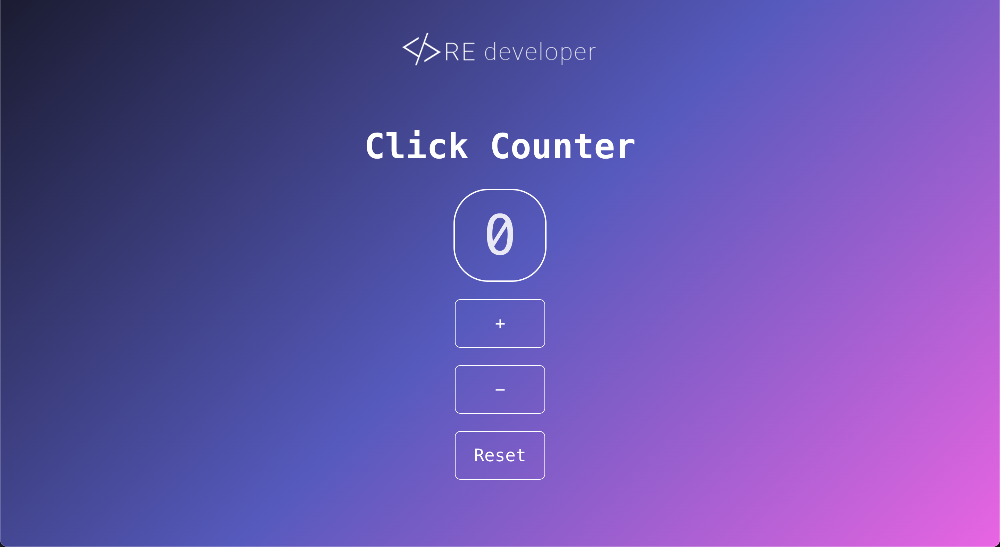

# Click Counter 

## Screenshots

)

👆 Experience a delightful click counting journey with this simple yet powerful Click Counter built using React, Vite, and TypeScript. Whether you're exploring the magic of React, the speed of Vite, or the type safety of TypeScript, this project brings them all together in a fun and interactive way. Just start the application, click the button, and watch the counter rise. It's a perfect playground to get hands-on with these cutting-edge technologies and enjoy the simplicity of a click counter. 🚀

## Technologies Used

## Contact

[Ricardo Estrada]

## 🔗 Links

