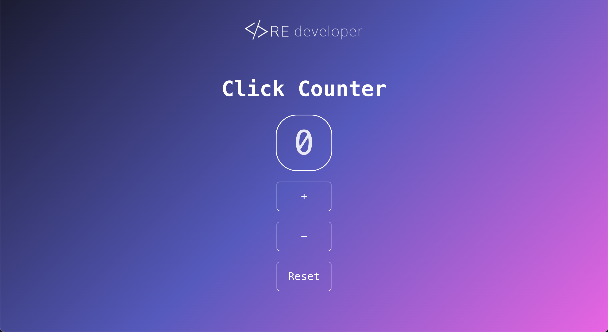

# React Click Counter Vite + React + TypeScript

A simple click counter built with React, Vite and TypeScript.

## Screenshots



## Technologies Used


## Installation

Ensure you have Node.js and npm installed on your machine. Then, clone the repository and run:

```bash
npm install
